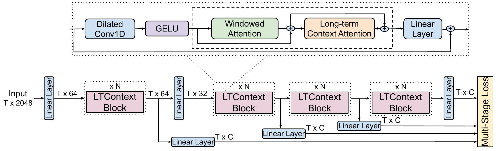
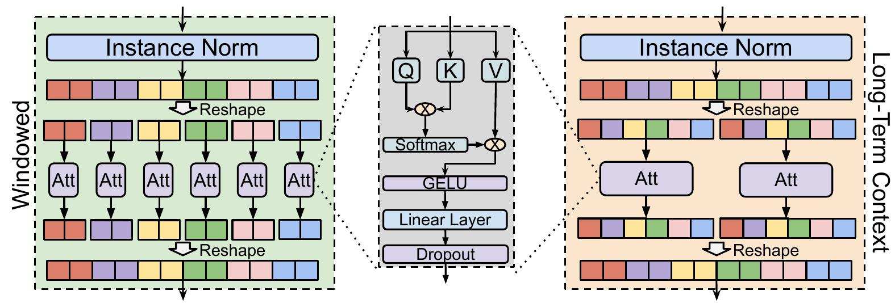

# LTContext

LTContext is an approach for temporal action segmentation, where it leverages
sparse attention to capture the long-term context of a video 
and windowed attention to model the local information in the neighboring frames.

Here is an overview of the architecture:
<p align="center">

</p>

The attention mechanism consist of Windowed Attention and Long-term Context Attention:
<p align="center">

</p>

## Citation
If you use this code or our model, please cite our [paper](https://arxiv.org/abs/2308.11358):
```latex
@inproceedings{ltc2023bahrami,
    author    = {Emad Bahrami and Gianpiero Francesca and Juergen Gall},
    title     = {How Much Temporal Long-Term Context is Needed for Action Segmentation?},
    booktitle = {IEEE International Conference on Computer Vision (ICCV)},
    year      = {2023}
}
```

## Installation

To create the [conda](https://docs.conda.io/en/latest/) environment run the following command:
```bash
conda env create --name ltc --file environment.yml
source activate ltc 
```


## Dataset Preparation
The features and annotations of the Breakfast dataset can be downloaded from 
[link 1](https://mega.nz/#!O6wXlSTS!wcEoDT4Ctq5HRq_hV-aWeVF1_JB3cacQBQqOLjCIbc8) 
or 
[link 2](https://zenodo.org/record/3625992#.Xiv9jGhKhPY).

### Assembly101
Follow the instructions at [Assembly101-Download-Scripts](https://github.com/assembly-101/assembly101-download-scripts) to download the `.lmdb` TSM features.
The annotations for action segmentation can be downloaded from [assembly101-annotations](https://drive.google.com/drive/folders/1QoT-hIiKUrSHMxYBKHvWpW9Z9aCznJB7). 
After downloading the annotation put `coarse-annotations` inside `data/assembly101` folder.
We noticed loading from `numpy` can be faster, you can convert the `.lmdb` features to `numpy` and use `LTContext_Numpy.yaml` config. 

## Training and Evaluating the model

Here is an example of the command to train the model. 
```bash
python run_net.py \
  --cfg configs/Breakfast/LTContext.yaml \
  DATA.PATH_TO_DATA_DIR [path_to_your_dataset] \
  OUTPUT_DIR [path_to_logging_dir]
```
For more options look at `ltc/config/defaults.py`.

The value of `DATA.PATH_TO_DATA_DIR` for assembly101 should be the path to the folder containing the TSM features. 

If you want to evaluate a pretrained model use the following command.
```bash
python run_net.py \
  --cfg configs/Breakfast/LTContext.yaml \
  DATA.PATH_TO_DATA_DIR [path_to_your_dataset] \
  TRAIN.ENABLE False \
  TEST.ENABLE True \
  TEST.DATASET 'breakfast' \
  TEST.CHECKPOINT_PATH  [path_to_trained_model] \
  TEST.SAVE_RESULT_PATH [path_to_save_result]
```
Check the [model card](MODEL_CARD.md) to download the pretrained models.

### Acknowledgement
The structure of the code is inspired by [SlowFast](https://github.com/facebookresearch/SlowFast). 
The MultiHeadAttention is based on [xFormers](https://github.com/facebookresearch/xformers).
We thank the authors of these codebases.

## License

<a rel="license" href="http://creativecommons.org/licenses/by-nc/4.0/"></a><br />This work is licensed under a <a rel="license" href="http://creativecommons.org/licenses/by-nc/4.0/">Creative Commons Attribution-NonCommercial 4.0 International License</a>.


